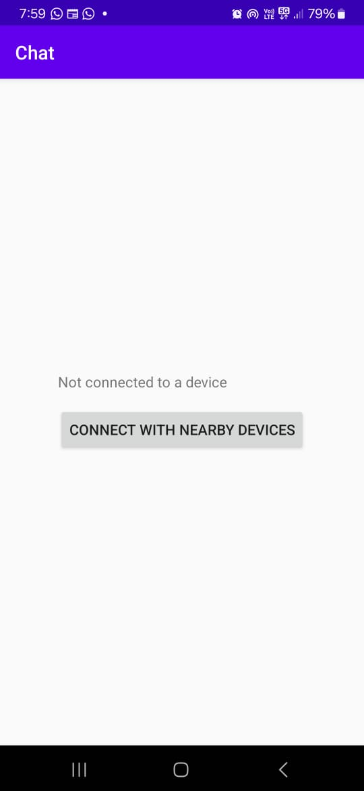
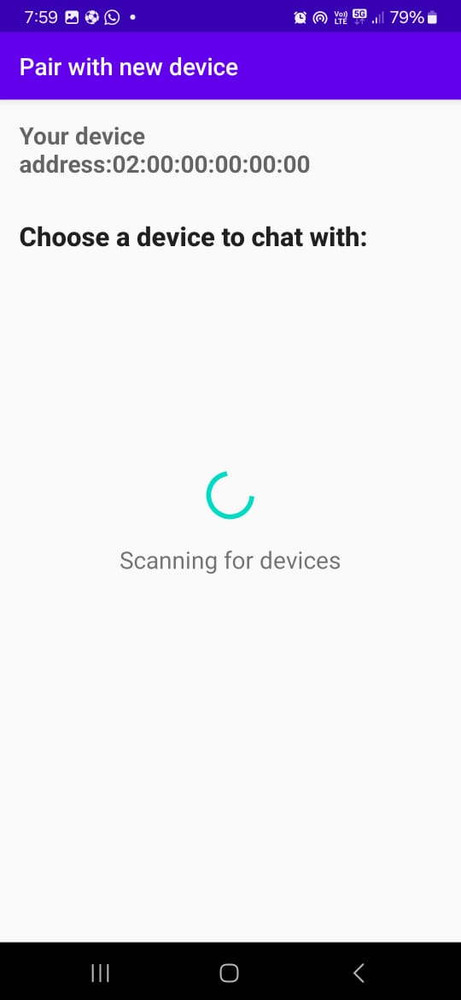
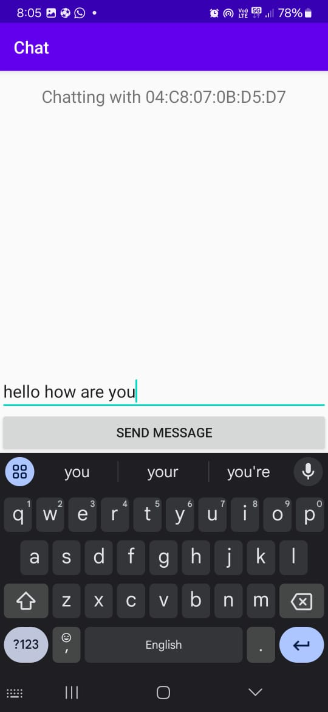
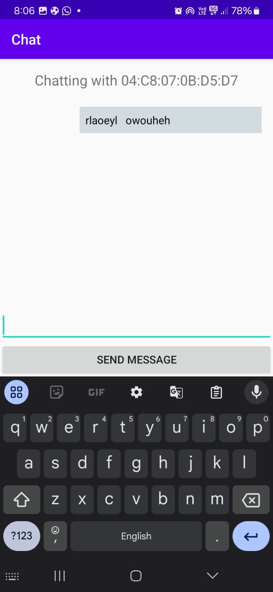
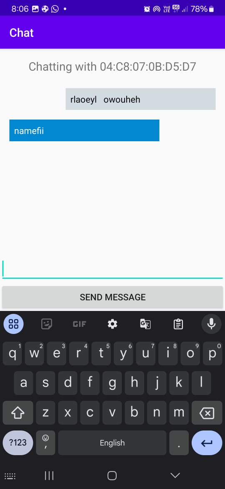

# Useless Bluetooth Chat App 🎯


## Basic Details
### Team Name: CodeCraft


### Team Members
- Team Lead: R Vaishnav Raj - College Of Engineering Trivandrum
- Member 2: Jayagovind P - College Of Engineering Trivandrum
- Member 3: Mehbin A C - College Of Engineering Trivandrum

### Project Description
A Bluetooth ChatApp that let you send messages in close proximity to another person having the app and the words will be send in a jumbled manner. 

### The Problem (that doesn't exist)
When people and very near to each other no one uses a chat app they talk to each other verbally.And The conversation is easily understood 

### The Solution (that nobody asked for)
Create an app that connects people sitting very near to each other.Also the messages and jumbled so that the conversition is not easily understood

## Technical Details
### Technologies/Components Used
For Software:
- Languages used: Kotlin
- Frameworks used: Android SDK  
- Libraries used: Android Bluetooth API, RecyclerView for message display
- Tools used: Android Studio, Git for version control

## For Hardware:

### Main components:
- Android smartphone
- Various Bluetooth-enabled devices (headphones, speakers)

### Specifications:
- Bluetooth 4.0 or higher
- Android 6.0 (Marshmallow) or higher

### Tools required:
- Android Studio
- USB cable for device connection


### Implementation
For Software:
# Installation
```bash
git clone https://github.com/yourusername/bluetooth-le-chat.git
cd bluetooth-le-chat
./gradlew build
```
# Run
```bash
./gradlew installDebug
```

### Project Documentation
For Software:

# Screenshots 
  
*Shows the opening page of the app.*

  
*Connecting to another user using the app via Bluetooth.*

  
*Typing the message to be sent.*

  
*Shows how the message was sent to the receiver (the words are jumbled).*

  
*Receives a message, but it was jumbled.*

Made with ❤️ at TinkerHub Useless Projects 


